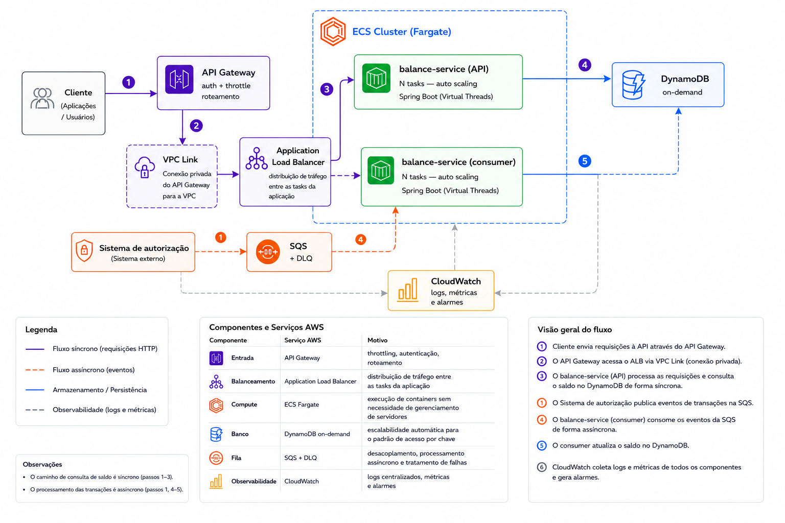

# Account Balance API

API de consulta de saldo bancário com processamento assíncrono de transações via SQS e persistência no DynamoDB.

---

## Objetivo

Processar eventos de transações de forma assíncrona, manter o saldo atualizado respeitando a ordem dos eventos e disponibilizar consultas de saldo com baixa latência.

---

## Tecnologias

- Java 21
- Spring Boot
- DynamoDB
- Amazon SQS
- LocalStack
- Docker
- Gradle
- Testcontainers
- Micrometer / Actuator

---

## Como executar

**Pré-requisitos:** Docker instalado e em execução. Docker Compose disponível.

Clone o repositório ou extraia o arquivo do projeto.

Abra o terminal e acesse o diretório raiz da aplicação:

```bash
cd account-balance-api
```

Execute os serviços:

```bash
docker compose up -d --build
```

Isso sobe três containers:

- `localstack` — emula SQS e DynamoDB localmente
- `message-generator` — publica transações sintéticas na fila
- `balance-service` — consome as mensagens e expõe a API REST

> O `balance-service` e o `message-generator` aguardam o LocalStack estar saudável antes de iniciar.

Para validar se a aplicação iniciou corretamente:

Windows:

```cmd
docker logs balance-service | findstr /i /c:"Started BalanceApplication"
```

Linux/macOS:

```bash
docker logs balance-service | grep "Started BalanceApplication"
```

Saída esperada:

```text
Started BalanceApplication in X seconds
```

Caso não retorne nada, aguarde alguns segundos e execute novamente.

A API estará disponível em `http://localhost:8080`.

Também é possível validar o health da aplicação em `http://localhost:8080/actuator/health`.

Resposta esperada:

```json
{
  "status": "UP"
}
```

### Consultar logs

Os comandos abaixo não reiniciam a aplicação. Eles apenas consultam os logs dos containers já em execução.

Para consultar os logs de todos os serviços da aplicação:

```bash
docker compose logs
```

Para acompanhar os logs em tempo real (e para sair da visualização, Ctrl + C):

```bash
docker compose logs -f
```

Para consultar os logs de um container específico, primeiro liste os containers em execução:

```bash
docker ps
```

Depois utilize o nome do container:

```bash
docker logs <nome-do-container>
```

Exemplo:

```bash
docker logs balance-service
```

Para acompanhar somente um container em tempo real:

```bash
docker logs -f balance-service
```

### Parar a aplicação

Para parar os containers:

```bash
docker compose down
```

### Subir novamente

Caso os containers já tenham sido criados e queira iniciar novamente:

```bash
docker compose up -d
```

Caso queira reconstruir as imagens:

```bash
docker compose up -d --build
```

---

## Testes via Postman

A coleção Postman está disponível em `postman/account-balance-api.postman_collection.json`.

Importe no Postman via **File → Import**.

A collection segue a mesma organização apresentada neste documento, separando os endpoints por domínio, e já possui exemplos de requisições configuradas para facilitar os testes da API.

---

### Testes via terminal

Além do Postman, os endpoints podem ser testados diretamente via `curl` pelo terminal.

Exemplo:

```bash
curl "http://localhost:8080/sample-accounts?limit=10"
```

---

## Endpoints

### Contas

**Listar amostra de contas** *(auxiliar de desenvolvimento e testes)*

```http
GET http://localhost:8080/sample-accounts?limit=10
```

Retorna uma lista de IDs disponíveis para facilitar os testes. Utiliza `scan` no DynamoDB e, por esse motivo, não seria recomendado para um cenário de produção com grande volume de dados.

**Consultar saldo**

```http
GET http://localhost:8080/balances/{accountID}
```

Retorna o saldo atual da conta informada. O accountId deve ser um dos IDs de contas retornados pela API de amostra de contas.

```json
{
  "id": "550e8400-e29b-41d4-a716-446655440000",
  "owner": "550e8400-e29b-41d4-a716-446655440001",
  "balance": {
    "amount": 174.92,
    "currency": "BRL"
  },
  "updated_at": "2025-07-05T18:04:13.433-03:00"
}
```

### Observabilidade

```http
GET http://localhost:8080
GET http://localhost:8080/actuator/health
GET http://localhost:8080/actuator/info
GET http://localhost:8080/actuator/metrics
GET http://localhost:8080/actuator/metrics/http.server.requests
```

**Métricas customizadas da aplicação:**

```http
GET http://localhost:8080/actuator/metrics/sqs.messages.processed
GET http://localhost:8080/actuator/metrics/sqs.messages.failed
GET http://localhost:8080/actuator/metrics/balance.updates.ignored
GET http://localhost:8080/actuator/metrics/transactions.ignored
```

---

## Fluxo da aplicação

```
message-generator
      │
      ▼
     SQS
      │
      ▼
TransactionConsumer (Spring Boot)
      │
      ├─ transação rejeitada? → descarta, incrementa métrica
      │
      └─ aprovada → saveIfNewer (DynamoDB Conditional Expression)
                          │
                          ▼
                      DynamoDB
                          │
                          ▼
                   GET /balances/{accountID} → resposta REST
```

O processamento dos eventos ocorre de forma assíncrona. A consulta de saldo não depende do processamento da mensagem em tempo real, pois o endpoint REST consulta o estado já persistido no DynamoDB.

Essa separação permite que picos de eventos sejam processados sem bloquear as consultas de saldo.

---

## Decisões técnicas

### Banco de dados — DynamoDB

**Benefícios**: acesso sempre por `accountId` (Partition Key), sem joins ou consultas complexas. O DynamoDB foi escolhido por oferecer baixa latência para consultas por chave e capacidade de escalar horizontalmente conforme o volume da aplicação.

**Trade-off:** abrir mão da flexibilidade de consultas complexas de um banco relacional em troca de melhor escalabilidade e desempenho para consultas por identificador da conta.

Valores monetários utilizam `BigDecimal` para evitar problemas de precisão e arredondamento comuns em tipos como `double`.

### Consistência — `saveIfNewer` com Conditional Expression

Para garantir que apenas informações mais recentes sejam persistidas, a atualização do saldo utiliza uma Conditional Expression executada diretamente pelo DynamoDB:

```
attribute_not_exists(lastUpdatedAt) OR lastUpdatedAt < :newDate
```

Com isso, eventos antigos são ignorados automaticamente e não sobrescrevem saldos já atualizados.

Como a validação acontece no próprio DynamoDB, a solução também evita problemas de concorrência quando múltiplas mensagens da mesma conta são processadas simultaneamente.

### Performance — Virtual Threads (Java 21)

Durante a execução com volume elevado de mensagens, foi observado aumento de latência nas requisições da API quando havia processamento intenso de mensagens pelo consumer SQS.

Como API e consumidores compartilham recursos da mesma aplicação, a competição por threads podia impactar o tempo de resposta das consultas de saldo.

Por isso, foi adotado o uso de Virtual Threads do Java 21 para aumentar a capacidade de processamento concorrente e reduzir o impacto do consumo de mensagens sobre os endpoints REST.

```yaml
spring:
  application:
    name: balance-service
  threads:
    virtual:
      enabled: true
```

**Benefícios**

- Melhor aproveitamento de operações bloqueantes de I/O.
- Maior quantidade de tarefas concorrentes com menor consumo de recursos.
- Redução da competição por threads entre API e consumidores.
- Configuração mais simples em comparação com pools de threads dedicados.

Complementarmente, foi configurado o Apache HTTP Client com pool de conexões para o DynamoDB, evitando o overhead de abertura de conexão TCP a cada requisição:

```java
ApacheHttpClient.builder()
    .connectionTimeout(Duration.ofSeconds(2))
    .socketTimeout(Duration.ofSeconds(2))
    .maxConnections(100)
    .connectionTimeToLive(Duration.ofSeconds(20))
    .connectionMaxIdleTime(Duration.ofSeconds(5))
```

Isso porque Virtual Threads e pool de conexões atuam em camadas diferentes. As primeiras permitem maior concorrência com menor custo de gerenciamento de threads no Tomcat, enquanto o segundo evita latência por reconexão TCP com o DynamoDB.

**Trade-off**

A configuração ideal de consumidores continua dependente da capacidade computacional disponível e do perfil de carga da aplicação.

Por esse motivo, a configuração final desse projeto foi mantida de forma conservadora para o ambiente de avaliação, podendo ser ajustada em produção conforme:

- CPU disponível
- Memória disponível
- Volume de mensagens
- Throughput desejado

### Resiliência — Retry com Exponential Backoff

O consumer possui retry automático para falhas consideradas transitórias, como timeouts ou indisponibilidade momentânea do DynamoDB.

A estratégia utilizada aumenta gradualmente o intervalo entre as tentativas:

```
tentativa 1 → falha → aguarda 200ms
tentativa 2 → falha → aguarda 400ms
tentativa 3 → falha → mensagem retorna para a fila SQS
```

Apenas erros transitórios são retentados. Mensagens malformadas ou inválidas são descartadas imediatamente, evitando reprocessamentos desnecessários.

Essa abordagem permite recuperação automática de falhas temporárias sem gerar carga adicional sobre os serviços dependentes.

### Arquitetura em camadas

Foi utilizada uma arquitetura em camadas com separação de responsabilidades entre:

- Configuration: configurações de infraestrutura e integrações
- Consumer: processamento assíncrono das mensagens SQS
- Controller: exposição dos endpoints REST
- DTO: contratos de entrada e saída
- Exception: tratamento padronizado de erros
- Model: entidade de domínio utilizada no processamento e persistência dos dados
- Repository: acesso e persistência no DynamoDB
- Service: regras de negócio e processamento do saldo


└───com

└───bank

└───balance

│   BalanceApplication.java

│

├───config

│       DynamoDbConfig.java

│       SqsConfig.java

│

├───consumer

│       TransactionConsumer.java

│

├───controller

│       BalanceController.java

│

├───dto

│       AccountSampleResponse.java

│       BalanceResponse.java

│       TransactionMessage.java

│

├───exception

│       AccountNotFoundException.java

│       GlobalExceptionHandler.java

│       RepositoryException.java

│

├───model

│       Account.java

│

├───repository

│       AccountItem.java

│       AccountRepository.java

│

└───service

BalanceService.java


A aplicação poderia seguir uma abordagem Hexagonal, porém, optei por manter uma estrutura mais simples para este cenário.

Como o fluxo principal envolve consulta de saldo e atualização através de eventos, a separação em camadas atende bem ao objetivo sem adicionar abstrações que não seriam utilizadas neste momento.

A estrutura mantém o código organizado e permite evolução caso novas regras de negócio ou integrações sejam adicionadas.

---

## Testes

> Não é necessário ter a aplicação rodando para executar os testes.

Abra um terminal e acesse o diretório raiz da aplicação:

```bash
cd account-balance-api
```

Execute:

Windows:

```bash
.\gradlew.bat test
```

Linux/macOS:

```bash
./gradlew test
```

A suíte executa todos os testes automatizados.

- **Testes unitários** (`BalanceServiceTest`, `TransactionMessageTest`)
  - executam sem dependências externas
  - utilizam Mockito para isolamento das regras de negócio

- **Testes de integração** (`AccountRepositoryTest`)
  - valida a integração com DynamoDB
  - utiliza Testcontainers para subir um LocalStack temporário durante a execução. Por isso, é necessário que o Docker esteja disponível e em execução.


Principais cenários cobertos:

- processamento de transação aprovada
- rejeição de transação inválida
- eventos fora de ordem
- eventos com mesmo timestamp
- atualização de saldo
- conta inexistente
- falhas no acesso ao repositório

O resultado da execução dos testes será exibido no terminal.

Em caso de sucesso:

```
BUILD SUCCESSFUL
```

Em caso de falha:

```
BUILD FAILED
```

### Relatório de Testes do Gradle

```text
build/reports/tests/test/index.html
```

Após a execução, abra o arquivo em um navegador para visualizar:
- testes executados
- tempo de execução
- falhas e erros
- detalhamento por classe de teste

---

## Melhorias consideradas para implementações futuras (e por quê)

**Full Jitter no Retry**

O retry atual utiliza backoff exponencial para falhas transitórias.

Como evolução, poderia ser adicionado Full Jitter para adicionar aleatoriedade ao delay e reduzir o risco de múltiplos consumidores realizarem retry ao mesmo tempo.

**Circuit Breaker**

Poderia ser utilizado Circuit Breaker, utilizando uma biblioteca como Resilience4j, para evitar chamadas repetidas ao DynamoDB durante períodos de instabilidade.

Não implementado devido ao escopo do desafio.

**Dead Letter Queue (DLQ)**

Mensagens que falhassem após todas as tentativas poderiam ser encaminhadas para uma DLQ, permitindo análise e reprocessamento controlado.

**Métricas adicionais**

O Actuator já expõe métricas HTTP através do Micrometer.

Como evolução, poderiam ser adicionadas métricas específicas para tempo de processamento do SQS e operações no DynamoDB.

**Testes de concorrência**

A atualização de saldo utiliza Conditional Expression atômica no DynamoDB para evitar sobrescrita por eventos antigos.

Um teste específico de concorrência poderia ser adicionado para simular múltiplos consumidores atualizando a mesma conta simultaneamente.

---

## Considerações sobre o ambiente local

O LocalStack é utilizado para simular os serviços AWS necessários durante o desenvolvimento local, como SQS e DynamoDB.

Por executar esses serviços no mesmo ambiente local, cenários de alta volumetria podem apresentar variações de latência dependendo dos recursos disponíveis na máquina utilizada.

Em um ambiente de produção na AWS, SQS e DynamoDB são serviços gerenciados e independentes, com infraestrutura própria e capacidade de escala configurável.

Por isso, métricas de performance obtidas localmente devem ser consideradas apenas como referência e não como equivalentes a um ambiente produtivo.

---

## Arquitetura cloud (proposta)

Para deploy em produção na AWS:

| Componente | Serviço AWS | Motivo |
|---|---|---|
| Entrada | API Gateway | throttling, autenticação, roteamento via VPC Link para ALB interno |
| Balanceamento | Application Load Balancer | distribuição de tráfego entre tasks |
| Compute | ECS Fargate | execução de containers sem necessidade de gerenciamento de servidores |
| Banco | DynamoDB on-demand | escalabilidade automática para o padrão de acesso por chave |
| Fila | SQS + DLQ | desacoplamento, processamento assíncrono e tratamento de falhas |
| Observabilidade | CloudWatch | logs centralizados, métricas e alarmes |

A aplicação poderia ser separada em dois grupos de execução:

- Tasks da API, responsáveis pelas consultas de saldo.
- Tasks de consumer, responsáveis pelo processamento das mensagens SQS.

Essa separação permite escalar cada componente de forma independente conforme a demanda, evitando que picos de processamento de eventos impactem as consultas REST.



> O cliente acessa a API exclusivamente via API Gateway. O ALB fica interno à VPC e é alcançado pelo API Gateway através de VPC Link, sem exposição pública direta.

---

## Pipeline de deploy (proposta)

Estratégia utilizando **Canary Release** para reduzir o risco de uma nova versão impactar todos os usuários:

```
1. Push na branch main
       │
       ▼
2. CI — build da aplicação + testes automatizados
       │
       ▼
3. Deploy em homologação
       │
       ▼
4. Deploy em Produção com Canary Release — nova versão recebe uma parcela inicial do tráfego
       │
       ├─ métricas ok por N minutos?
       │         │
       │         ▼
       │   rollout gradual (25% → 50% → 100%)
       │
       └─ erro detectado → rollback automático
```

Durante o período de Canary são acompanhadas métricas como:

- taxa de erro
- latência das requisições
- consumo de recursos
- falhas no processamento de mensagens

Caso os indicadores permaneçam dentro do esperado, o tráfego é aumentado gradualmente.

Essa estratégia reduz o impacto de possíveis falhas, permitindo validar uma nova versão com uma quantidade limitada de usuários antes da liberação completa.
